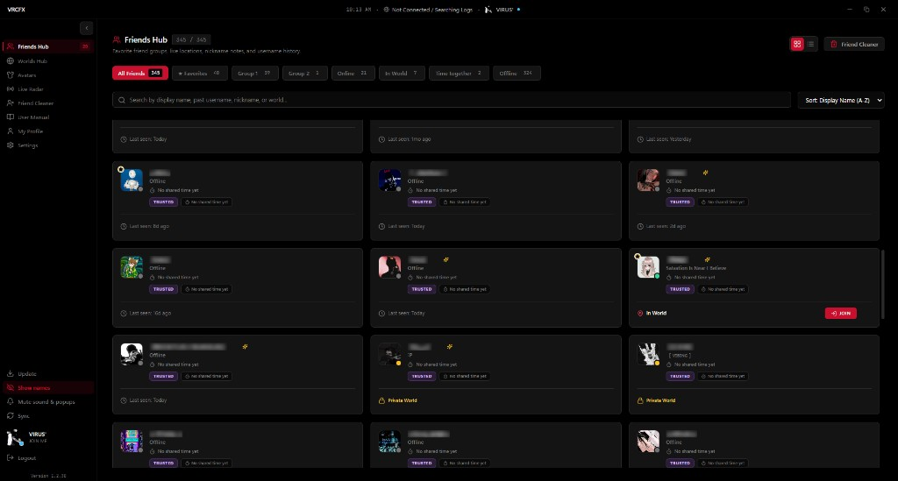
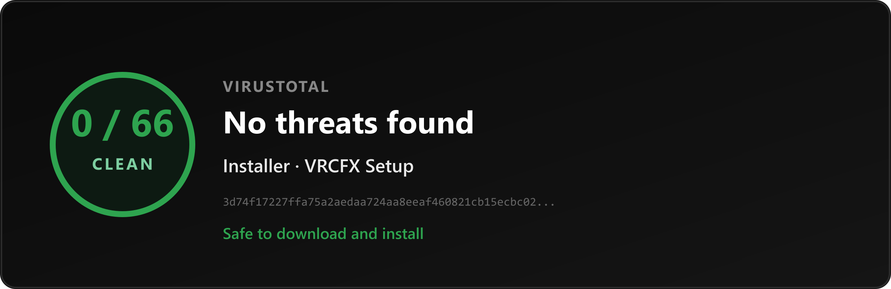
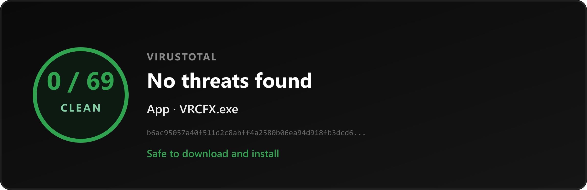

  

<h1 align="center">VRCFX</h1>

  <strong>A Windows desktop app for VRChat players.</strong>

  Track friends, browse worlds, switch avatars, and see who is in your room 
  while VRChat runs full screen beside you.

  
  
  

  <a href="https://github.com/DARKSIDE957/VRCFX/releases/latest">Download latest release</a>
  ·
  <a href="./PRIVACY.md">Privacy</a>
  ·
  <a href="https://github.com/DARKSIDE957/VRCFX/issues">Support</a>

  

## What is VRCFX?

**VRCFX** is a free Windows toolkit that sits next to VRChat. It does **not** replace the game. It gives you a clear desktop window for the things players need all the time:

- Who of your friends is online, and where they are
- Which worlds are trending, saved, or open right now (including age-gated instances when you can see them)
- Which avatar you want to wear next
- Who just joined the instance you are in
- Optional alerts on your desktop when something important happens

Sign in with your normal VRChat account (2FA supported). Most of your notes, settings, and history stay on your PC.

## What it does

### Friends
See online and offline friends, their current world, past names, and your own notes. Clean inactive contacts when the list gets too large.

### Worlds
Explore trending, top rated, hot, games, hangout, and music & club worlds. Open a world to list live instances, join a specific room, and spot **age verification (18+)** instances when the API shows them. Save favorites and set a home world.

### Avatars
Browse favorites and wear one in a click. Free lists always work; VRC+ lists unlock when your account has Plus.

### Live Radar
Reads VRChat’s local log files on your PC to show who is in your current room, with avatars when available. Includes in-game join/leave logs and visited world history with thumbnails.

### Alerts & overlays
In-app toasts and optional desktop overlays for friend online, world changes, room joins, and more. Mute everything from the sidebar when you want quiet.

### Themes, text size & languages
Built-in themes plus a custom color builder, text size that scales fonts only, and full UI languages: English, Arabic, Spanish, and French.

## Install

1. Download the latest Windows installer from [Releases](https://github.com/DARKSIDE957/VRCFX/releases/latest).
2. Run the setup. If VRCFX is already installed, it shows the current path and version, and only updates when it should.
3. Sign in with your VRChat account.
4. Use the sidebar: Friends, Worlds, Avatars, Radar, Guide, and Settings.

## Windows Smart App Control

On **Windows 11**, **Smart App Control** can block or remove VRCFX while you download or install it. That is a Windows safety feature. It does **not** mean VRCFX is malware.

### Why Smart App Control blocks VRCFX

VRCFX is downloaded from GitHub, not the Microsoft Store. New or independently published apps often have no reputation score yet. Smart App Control only allows apps it already trusts. Until VRCFX is widely recognized, Windows may stop the installer or the app from running.

### What to do when installing

1. Open **Windows Security** → **App & browser control** → **Smart App Control**.
2. Turn Smart App Control **Off** before you download the installer.
3. Download VRCFX from [Releases](https://github.com/DARKSIDE957/VRCFX/releases/latest) and run the setup.
4. After installation finishes and VRCFX opens normally, you can turn Smart App Control **back On**.

If Windows shows a one-time prompt for this file only, you can also choose **Run anyway** or allow the app instead of disabling Smart App Control for the whole system.

## Safe to install

The Windows installer and the app were scanned on VirusTotal. You can scan any download yourself:

1. Go to [VirusTotal](https://www.virustotal.com/gui/home/upload).
2. Upload the installer or `VRCFX.exe` you just downloaded.
3. Wait for the report before you install.

Do this again whenever you download a new version. Each build is a new file.

  <a href="https://www.virustotal.com/gui/file/3d74f17227ffa75a2aedaa724aa8eeaf460821cb15ecbc0204f67acceed73bf7"><strong>Installer report</strong></a>
  ·
  <a href="https://www.virustotal.com/gui/file/b6ac95057a40f511d2c8abff4a2580b06ea94d918fb3dcd6bbd9c3b7d64e727e"><strong>App report</strong></a>
  ·
  <a href="https://www.virustotal.com/gui/home/upload"><strong>Scan a file yourself</strong></a>

  

  

## Updates

In the app, open **Update** in the sidebar (above Mute).

VRCFX checks Releases, downloads a newer installer when one exists, closes for setup, then opens again when install finishes.

## Privacy

VRCFX is built to run on your computer. Most data stays local. It talks to official VRChat APIs for login and game data.

Full details: **[Privacy Policy](./PRIVACY.md)**

In the app: **Settings → Privacy & Policy**, or **Guide → Privacy & Data**.

## Help

Something break?

1. Note what you were doing.
2. Note which version you are on (Settings footer or sidebar).
3. [Open an issue](https://github.com/DARKSIDE957/VRCFX/issues) on this repository.

## Like VRCFX?

Share it with friends who play VRChat. Use this repo or the [latest download](https://github.com/DARKSIDE957/VRCFX/releases/latest).

A star on GitHub helps too.

  
  

  VRCFX, the desktop toolkit for VRChat on Windows.

