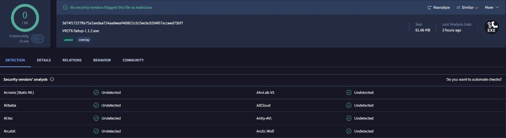
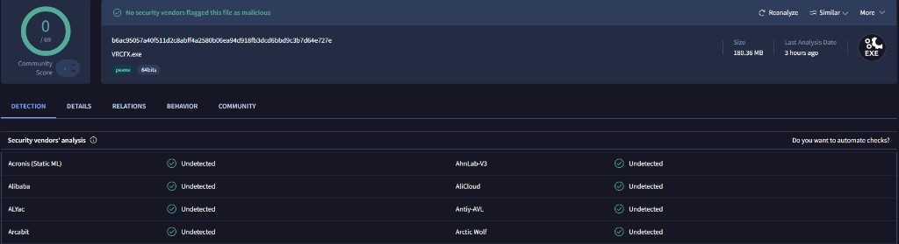

  

<h1 align="center">VRCFX</h1>

  <strong>Your VRChat toolkit for Windows.</strong>

  Friends. Avatars. Worlds. Live room awareness. 
  Built to sit beside the game, not on top of it.

  
  
  

  <a href="https://github.com/DARKSIDE957/VRCFX/releases/latest">Download latest release</a>
  ·
  <a href="./PRIVACY.md">Privacy</a>
  ·
  <a href="https://github.com/DARKSIDE957/VRCFX/issues">Support</a>

---

## Why VRCFX

VRChat already takes the whole screen. VRCFX keeps the useful stuff nearby:

who is online, what you wear, where you jump next, and who just walked into your instance.

No clutter. No noise. Just the tools you reach for while you play.

---

## Features

### Friends
See who is online and where they went. Spot quiet contacts and keep your list tidy.

### Avatars
Wear a favorite in one click. The free list always works. VRC+ lists unlock when your account has Plus.

### Worlds
Open saved places fast, or explore what is active right now.

### Live Radar
Know who is in your instance from local VRChat logs, as it happens on your PC.

### Alerts
Clear notifications in the app or on the desktop. Turn them on when you want them. Mute when you do not.

---

## Install

1. Download the latest Windows installer from [Releases](https://github.com/DARKSIDE957/VRCFX/releases/latest).
2. Run the setup. If VRCFX is already installed, it shows the current path and version, and only updates when it should.
3. Sign in with your VRChat account. 2FA is supported.
4. Use the sidebar to move between Friends, Worlds, Avatars, Radar, and Settings.

Your notes, settings, and local history stay on your computer across updates.

---

## Safe to install

VRCFX is totally safe to download and use.

The Windows installer and the app were both scanned on VirusTotal. No antivirus engines reported malware or anything harmful.

  <a href="https://www.virustotal.com/gui/file/3d74f17227ffa75a2aedaa724aa8eeaf460821cb15ecbc0204f67acceed73bf7"><strong>Installer report</strong></a>
  ·
  <a href="https://www.virustotal.com/gui/file/b6ac95057a40f511d2c8abff4a2580b06ea94d918fb3dcd6bbd9c3b7d64e727e"><strong>App report</strong></a>

  

  

---

## Updates

In the app, open **Update** in the sidebar (above Mute).

VRCFX checks Releases, downloads a newer installer when one exists, closes for setup, then opens again when install finishes.

---

## Privacy

VRCFX is built to run on your computer. Most data stays local.

Full details: **[Privacy Policy](./PRIVACY.md)**

In the app: **Settings → Privacy & Policy**, or **Guide → Privacy & Policy**.

---

## Help

Something break?

1. Note what you were doing.
2. Note which version you are on.
3. [Open an issue](https://github.com/DARKSIDE957/VRCFX/issues) on this repository.

---

  VRCFX. A cleaner desktop experience for VRChat.

